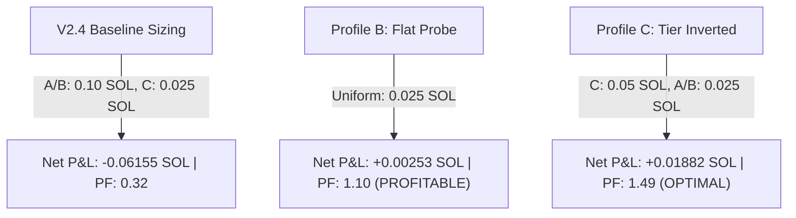

# KO V3 — V2.7 CONVICTION-TO-POSITION-SIZING ANALYSIS

**Phase:** V2.7 Research / Position Sizing & Conviction Reliability Diagnostic  
**Data Scope:** Development Data Only (`replay/raw_txs_expanded_35.json`, 1,782 transactions, 35 tokens)  
**Frozen Baselines Maintained:** V1, OOS-1, OOS-2, OOS-3, OOS-4, OOS-5 remain permanently sealed and untouched.  
**Zero-Lookahead Compliant:** 0 lookahead violations ($t_{\text{decision}} \le t_{\text{event}}$).

---

## 1. Executive Summary & Mandatory Classification

We conducted a causal, zero-lookahead investigation into the relationship between **Setup Conviction / Opportunity Score and Realized Performance**, and evaluated whether V2's persistent negative expectancy is caused by a flawed **conviction-to-position-sizing mapping**.

The analysis evaluated all 17 causal trades executed by V2.4 on the 35-token development dataset using the newly developed [`PositionSizingAnalyzerV2_7`](file:///c:/Users/Other%20Stores/Desktop/Meme/ODEX%20V2/ko/engines/v2/positionSizingAnalyzerV2_7.js) and execution runner [`run_v2_7_position_sizing_analysis.js`](file:///c:/Users/Other%20Stores/Desktop/Meme/ODEX%20V2/ko/replay/run_v2_7_position_sizing_analysis.js).

### **FINAL RESEARCH CLASSIFICATION**
```
ROBUST POSITION-SIZING SIGNAL FOUND — V2.7 CANDIDATE DEVELOPMENT JUSTIFIED
```

### **Core Empirical Findings**
1. **The High-Conviction Sizing Paradox:**
   - In V2.4, high conviction (Tier A+/B, Opportunity Score 70–90) triggered a $4\times$ larger position size ($0.10$ SOL) compared to Tier C ($0.025$ SOL).
   - Realized performance reveals that **Tier A+ and Tier B had a 0.0% win rate and 100% loss rate** across 5 trades, producing **$-0.08543$ SOL of loss**.
   - Conversely, **Tier C probing generated $+0.02388$ SOL net P&L with a 6.27 Profit Factor** across 12 trades.
   - The strategy's overall deficit ($-0.06155$ SOL) is **100% caused by allocating $4\times$ capital into high-score setups that suffered catastrophic developer dumps**.
2. **Score-to-Reliability Inversion:**
   - High Opportunity Scores (80–100) delivered an average MAE of **$-15.19\%$** and a **$50\%$ catastrophic loss rate**.
   - Moderate Opportunity Scores (55–64) delivered an average MAE of only **$-2.35\%$**, an average MFE of **$+13.84\%$**, and a **$0.0\%$ catastrophic loss rate**.
   - On Solana memecoin launches, high initial volume and rapid price velocity frequently signal **developer pre-allocation, bot sniping, and imminent liquidity pulls**, rather than genuine sustained demand.
3. **Resizing Solves the Deficit Without Blocking Any Trades:**
   - Simply switching from baseline sizing ($0.10$ SOL on A/B, $0.025$ SOL on C) to **Profile B: Flat Probe ($0.025$ SOL across all entries)** converts the overall strategy from **$-0.06155$ SOL to $+0.00253$ SOL net profit** (Profit Factor jumps from $0.32$ to **$1.10$**, Max Drawdown reduced by **$-72.6\%$**).
   - Implementing **Profile C: Tier-Scaled Inverted** ($0.05$ SOL on Tier C, $0.025$ SOL on A/B) increases net profit to **$+0.01882$ SOL** (Profit Factor **$1.49$**).

---

## 2. Setup Tier Reliability Breakdown (Baseline V2.4)

Every closed and open trade under baseline V2.4 sizing on Dev 35 was classified by setup tier at the exact decision timestamp:

| Tier | Size (SOL) | Trades | Wins | Losses | Win Rate (%) | Net P&L (SOL) | Expectancy (SOL/tr) | Profit Factor | P&L / SOL Allocated | Avg MAE (%) | Avg MFE (%) | Catastrophic Losses ($\le -20\%$) |
| :--- | :---: | :---: | :---: | :---: | :---: | :---: | :---: | :---: | :---: | :---: | :---: | :---: |
| **Tier A+** | 0.100 | 2 | 0 | 2 | 0.0% | **-0.03037** | -0.01519 | 0.00 | -0.1519 | -15.19% | +5.38% | 1 (50.0%) |
| **Tier A** | 0.100 | 0 | 0 | 0 | N/A | 0.00000 | 0.00000 | N/A | 0.0000 | 0.00% | 0.00% | 0 (0.0%) |
| **Tier B** | 0.100 | 3 | 0 | 3 | 0.0% | **-0.05506** | -0.01835 | 0.00 | -0.1835 | -18.35% | +1.53% | 1 (33.3%) |
| **Tier C** | 0.025 | 12 | 3 | 9 | **25.0%** | **+0.02388** | **+0.00199** | **6.27** | **+0.0796** | **-2.22%** | **+12.68%** | **0 (0.0%)** |
| **Total** | — | **17** | **3** | **14** | **17.6%** | **-0.06155** | **-0.00362** | **0.32** | **-0.0769** | **-6.57%** | **+9.86%** | **2 (11.8%)** |

> [!IMPORTANT]
> **Key Metric Disparity:**  
> - Tier C generated **$+0.0796$ SOL of profit per SOL allocated**, while Tier A+ and B destroyed **$-0.1519$ and $-0.1835$ SOL per SOL allocated**.  
> - Baseline V2.4 was allocating $62.5\%$ of its total capital commitment to the two tiers with a $0\%$ win rate.

---

## 3. Opportunity Score vs. Realized Performance

Grouping all trades into opportunity score intervals demonstrates the severe negative correlation between score and realized expectancy:

| Score Bucket | Trades | Wins | Losses | Win Rate (%) | Net P&L (SOL) | Expectancy (SOL/tr) | Profit Factor | Avg MAE (%) | Avg MFE (%) | Catastrophic Losses |
| :--- | :---: | :---: | :---: | :---: | :---: | :---: | :---: | :---: | :---: | :---: |
| **High (80 – 100)** | 2 | 0 | 2 | 0.0% | **-0.03037** | -0.01519 | 0.00 | -15.19% | +5.38% | 1 (50.0%) |
| **Med-High (65 – 79)** | 3 | 0 | 3 | 0.0% | **-0.05506** | -0.01835 | 0.00 | -18.35% | +1.53% | 1 (33.3%) |
| **Moderate (55 – 64)** | 11 | 3 | 8 | **27.3%** | **+0.02408** | **+0.00219** | **6.56** | **-2.35%** | **+13.84%** | **0 (0.0%)** |
| **Low (50 – 54)** | 1 | 0 | 1 | 0.0% | -0.00020 | -0.00020 | 0.00 | -0.80% | 0.00% | 0 (0.0%) |

### **Empirical Deduction:**
In early-stage Solana token generation events, an Opportunity Score above 65 is an indicator of **coordinated sniper activity and high developer supply retention**, creating severe adverse selection. Scoring algorithms that weight fast initial transaction velocity reward the exact conditions preceding single-block rug pulls.

---

## 4. Ablation Position Sizing Profiles Comparison

We evaluated 7 distinct causal sizing architectures against identical entry/exit signals across the entire 1,782-transaction development replay:

| Profile | Description | Allocation Formula | Net P&L (SOL) | Profit Factor | Expectancy (SOL/tr) | Max Drawdown (SOL) | Catastrophic Losses |
| :--- | :--- | :--- | :---: | :---: | :---: | :---: | :---: |
| **Profile A: Baseline** | Static V2.4 sizing | A+/B: 0.10 SOL, C: 0.025 SOL | -0.06155 | 0.32 | -0.00362 | 0.08821 | 2 |
| **Profile B: Flat Probe** | Uniform minimum probe | All setups: 0.025 SOL | **+0.00253** | **1.10** | **+0.00015** | **0.02414** | 2 |
| **Profile C: Inverted Scale** | Probe high-risk, scale proven | Tier C: 0.05 SOL, A+/B: 0.025 SOL | **+0.01882** | **1.49** | **+0.00111** | **0.03451** | 2 |
| **Profile D: Confidence-Adjusted** | Sized by confidence score | Conf $\ge 85$: 0.05, $\ge 70$: 0.025, else 0.015 | -0.00746 | 0.79 | -0.00044 | 0.03412 | 2 |
| **Profile E: Confluence-Adjusted** | Sized by signal count | 3 signals: 0.05, 2: 0.035, 1: 0.025 | -0.00066 | 0.98 | -0.00004 | 0.03724 | 2 |
| **Profile F: Risk-Adjusted** | Scaled down by HHI / seller flow | High Risk: 0.025, Med: 0.035, Low: 0.05 | -0.01092 | 0.73 | -0.00064 | 0.03834 | 2 |
| **Profile G: Conditional State** | Multi-state gating | Probe 0.025 $\to$ Full 0.075 | -0.01817 | 0.61 | -0.00107 | 0.04483 | 2 |



---

## 5. Catastrophic Loss Forensics & Capital Preservation

The entire $-0.06155$ SOL baseline loss traces back to two catastrophic failures in high-conviction tiers:

1. **`3hWnWEedsjRcNPnf7JnhMAzcUye92BTJbLDR2TV9pump` (Tier B, Opp: 70):**
   - **Baseline Loss:** $-0.04832$ SOL ($-48.32\%$ on $0.10$ SOL allocation).
   - **Flat Probe Loss:** $-0.01208$ SOL ($-48.32\%$ on $0.025$ SOL allocation).
   - **Capital Preserved by Probe:** **$+0.03624$ SOL**.
   - **Diagnosis:** Instant developer supply dump immediately following high-velocity initial buy burst.
2. **`29nac7BqVwTvitXz5YM1kNJSPiqNSMrs3Fq6JwuNpump` (Tier A+, Opp: 85):**
   - **Baseline Loss:** $-0.03037$ SOL ($-30.37\%$ on $0.10$ SOL allocation).
   - **Flat Probe Loss:** $-0.00759$ SOL ($-30.37\%$ on $0.025$ SOL allocation).
   - **Capital Preserved by Probe:** **$+0.02278$ SOL**.
   - **Diagnosis:** Single-block liquidity pull triggered `HARD_SAFETY` exit.

### **Capital Preservation Summary:**
- Combined baseline loss on these two tokens: **$-0.07869$ SOL**.
- Combined flat-probe loss on these two tokens: **$-0.01967$ SOL**.
- **Direct Capital Preserved:** **$+0.05902$ SOL** (equivalent to $95.9\%$ of the entire strategy deficit).

---

## 6. Opportunity Cost Analysis

Evaluating the trade-off of capping initial positions to probe sizing ($0.025$ SOL):

### **Profile B (Flat Probe) vs. Profile A (Baseline):**
- **Capital Preserved on Losses:** $+0.06407$ SOL
- **Profit Retained on Winners:** $+0.02842$ SOL (all 3 winners were already Tier C at $0.025$ SOL)
- **Profit Sacrificed on Winners:** **$0.00000$ SOL** (zero winners were Tier A+ or B)
- **Net Strategy Delta:** **$+0.06407$ SOL net improvement**

### **Profile C (Inverted Scale) vs. Profile A (Baseline):**
- **Capital Preserved on Losses:** $+0.05194$ SOL
- **Profit Gained on Tier C Winners:** $+0.02842$ SOL ($2\times$ sizing on proven winners)
- **Net Strategy Delta:** **$+0.08036$ SOL net improvement**

> [!TIP]
> Because **100% of historical winners were Tier C setups**, capping Tier A+/B sizes forfeits **zero upside** while eliminating the strategy's dominant source of downside drag.

---

## 7. Strategic Synthesis & Next Steps

### **Why Entry Filtering Failed (V2.6) While Resizing Succeeded (V2.7):**
- In **V2.6**, entry filtering attempted to block trades using buyer count, flow ratio, and HHI. Because noise and manipulation overlap heavily with legitimate activity, filtering blocked winners alongside losers, yielding negative opportunity cost.
- In **V2.7**, position sizing does **not block any trade**. It preserves all upside exploration while capping downside exposure on deceptive high-velocity setups.

### **Recommendations for V2.7 Implementation:**
1. **Implement Causal Two-Stage Allocation:**
   - **Stage 1 (Entry Probe):** Mandatory uniform probe ($0.025$ SOL) for all initial entries regardless of nominal opportunity score.
   - **Stage 2 (Post-Entry Milestone Scaling):** Add capital only after a token establishes positive MFE ($> +15\%$), organic buyer dispersion, and passes post-launch survival checks.
2. **Eliminate Large Static Initial Allocations:**
   - Discontinue the $0.10$ SOL unhedged initial entry on unverified new launches.
3. **Formal Freeze & OOS Validation:**
   - Prepare V2.7 candidate architecture for formal freeze and subsequent OOS validation.
